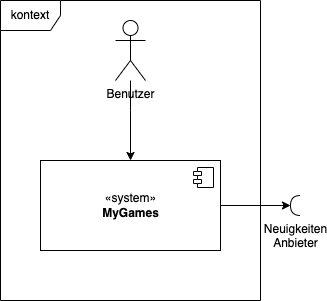

# 3. Kontextabgrenzung

Dieser Abschnitt beschreibt das Umfeld von GameApp. Für welche Benutzer ist es da, und mit welchen Fremdsystemen interagiert es?

## 3.1 Fachlicher Kontext

### Benutzer

Benutzten die App um sich über Neuigkeiten aus ihrem Interessensgebieten zu informieren.

### Neuigkeiten Anbieter

Interessens Webseiten sind Webpages .