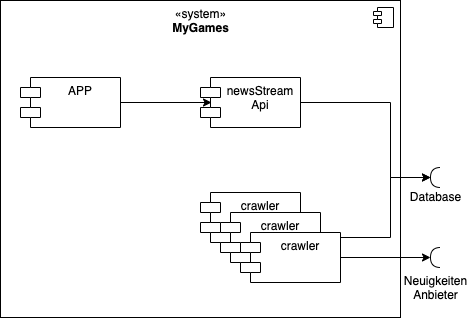

# 5. Bausteinsicht

Dieser Abschnitt beschreibt die Zerlegung von GameApp in Services. Jeder Service wird als FaaS bereitgestellt.

| Module        | Kurzbeschreibung                                                          |
|---------------|---------------------------------------------------------------------------|
| App           | Native Mobile App                                                         |
| newsStreamApi | Rest API zum laden aller Neuigkeiten                                      |
| crawler       | Service welcher die Daten eines Neuigkeiten Anbieter lädt und aufarbeitet |
