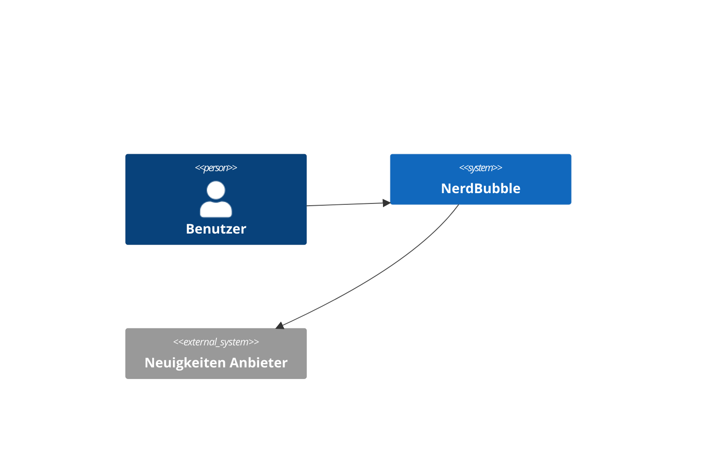

# 3. Kontextabgrenzung

> Dieser Abschnitt beschreibt das Umfeld von NerdBubble. Für welche Benutzer ist es da, und mit welchen Fremdsystemen interagiert es?

## 3.1 Fachlicher Kontext

### Benutzer

Benutzen die App um sich über Neuigkeiten aus ihrem Interessensgebieten zu informieren.

### Neuigkeiten Anbieter

Webseiten oder APIs welche nach den Interessen der Benutzer durchsucht werden. 
