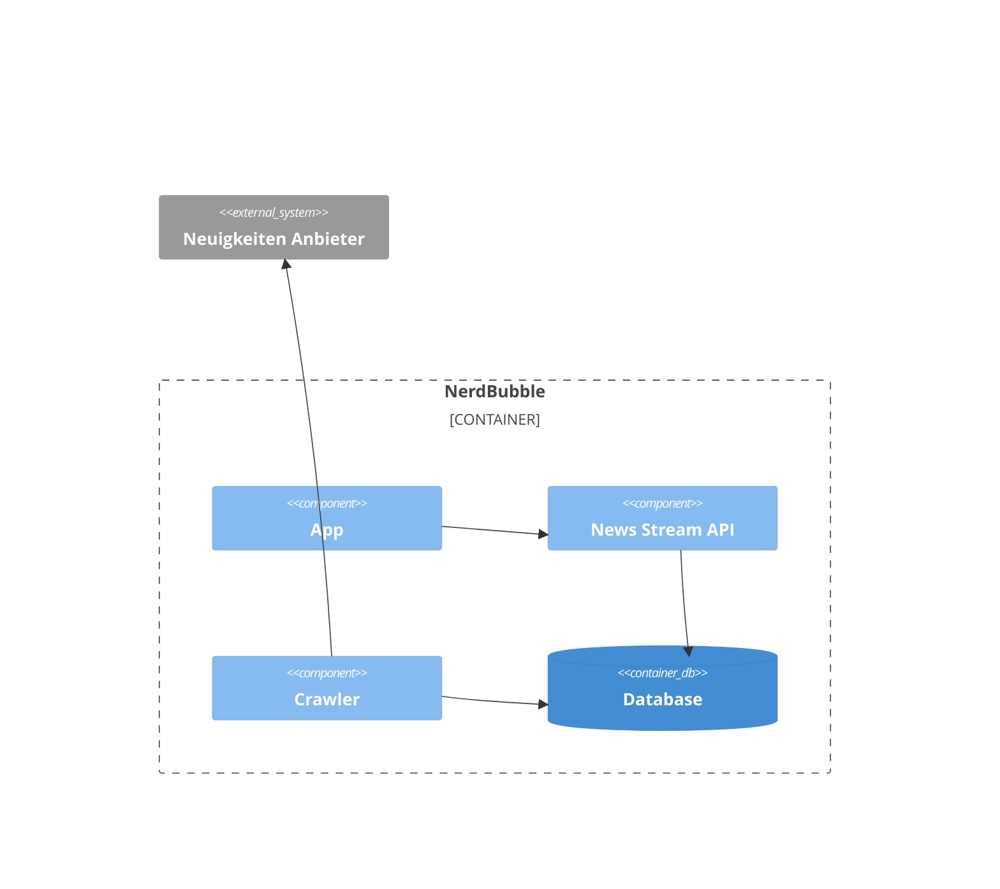

# 5. Bausteinsicht

> Dieser Abschnitt beschreibt die Zerlegung von NerdBubble in Services. Jeder Service wird als FaaS bereitgestellt.

| Module          | Kurzbeschreibung                                                          |
|-----------------|---------------------------------------------------------------------------|
| App             | Native Mobile App                                                         |
| News Stream API | Rest API zum laden aller Neuigkeiten                                      |
| crawler         | Service welcher die Daten eines Neuigkeiten Anbieter lädt und aufarbeitet |
