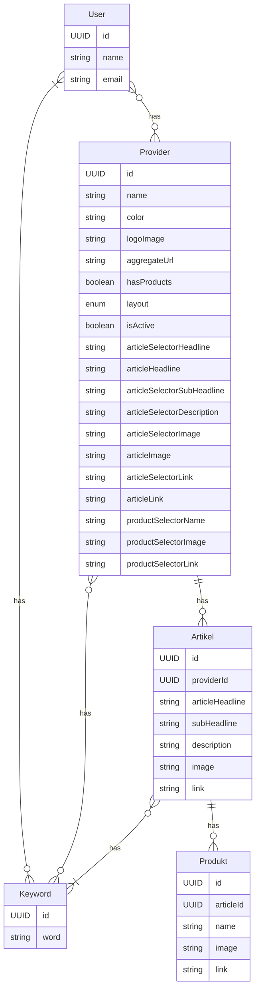

# 8. Querschnittliche 

## 8.1. Domain Entity Model

```mermaid
erDiagram
    User }|--o{ Keyword: has
    User }o--o{ Provider: has
    User {
        UUID id
        string name
        string email
    }
    Provider }o--o{ Keyword: has
    Provider ||--o{ Artikel: has
    Provider {
        UUID id
        string name
        string color
        string logoImage
        string aggregateUrl
        boolean hasProducts
        enum layout
        boolean isActive
        string articleSelectorHeadline
        string articleHeadline
        string articleSelectorSubHeadline
        string articleSelectorDescription
        string articleSelectorImage
        string articleImage
        string articleSelectorLink
        string articleLink
        string productSelectorName
        string productSelectorImage
        string productSelectorLink
    }
    Keyword {
        UUID id
        string word
    }
    Artikel ||--o{ Produkt: has
    Artikel }o--|{ Keyword: has
    Artikel {
        UUID id
        UUID providerId
        string articleHeadline
        string subHeadline
        string description
        string image
        string link
    }
    Produkt {
        UUID id
        UUID articleId
        string name
        string image
        string link
    }
    
```
